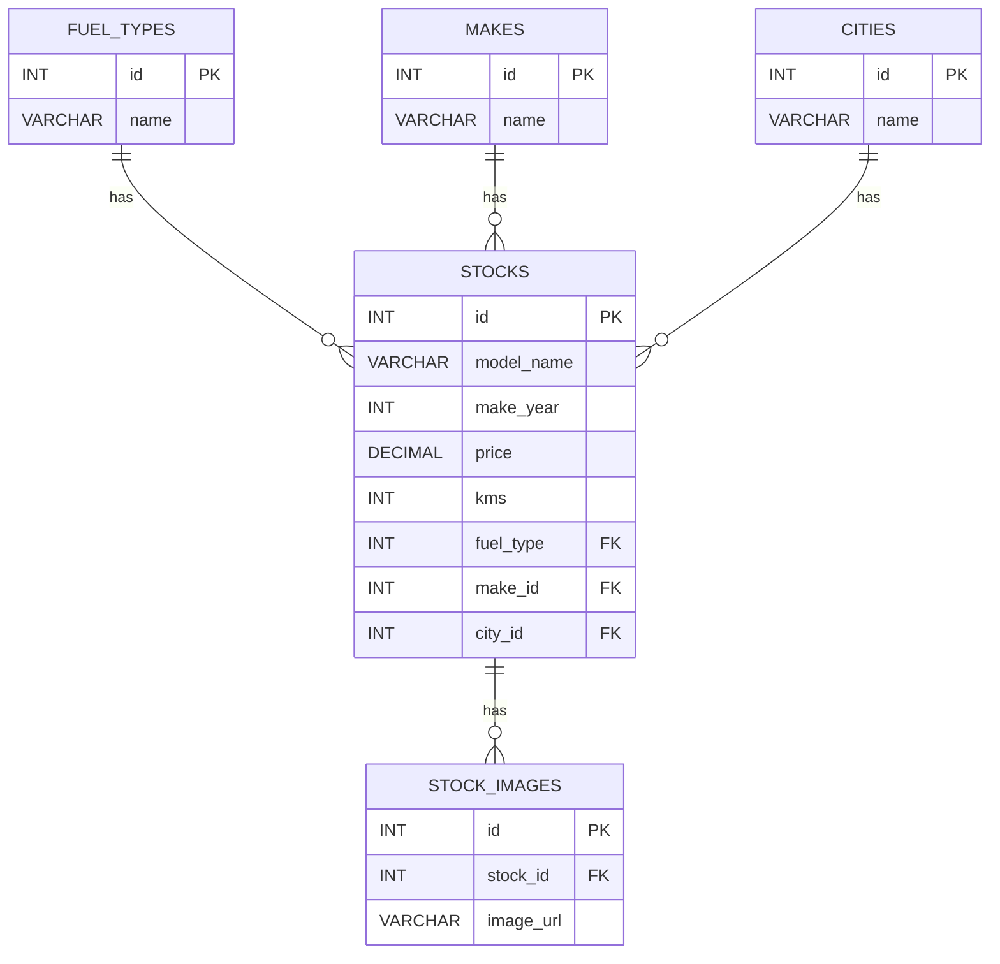

## Env Setup
### To run the application locally we need to set the below env variables to set up the db connection
```
$env:ConnectionStrings__DefaultConnection="Server=localhost;Port=3306;Database=carwale;User ID=root;Password=<YOUR_PASSWORD>;"
```
```
$env:TEST_DB_CONNECTION_STRING="Server=localhost;Port=3306;Database=carwale_test;User ID=root;Password=<YOUR_PASSWORD>;"
```

## Architecture

```text
    React Client
        │
        │ HTTP / JSON
        ▼
┌─────────────────────┐
│     StocksApi       │
│---------------------│
│    Controller       │
│        ↓            │
│       BAL           │
│        ↓            │
│       DAL           │
└─────────┬───────────┘
          │
          │ gRPC
          ▼
┌────────────────────────┐
│   StocksMicroservice   │
│------------------------│
│    gRPC Service        │
│         ↓              │
│        DAL             │
│         ↓              │
│    Dapper / SQL        │
└──────────┬─────────────┘
           │
           ▼
      ┌──────────┐
      │  MySQL   │
      └──────────┘
```

## Database Schema

